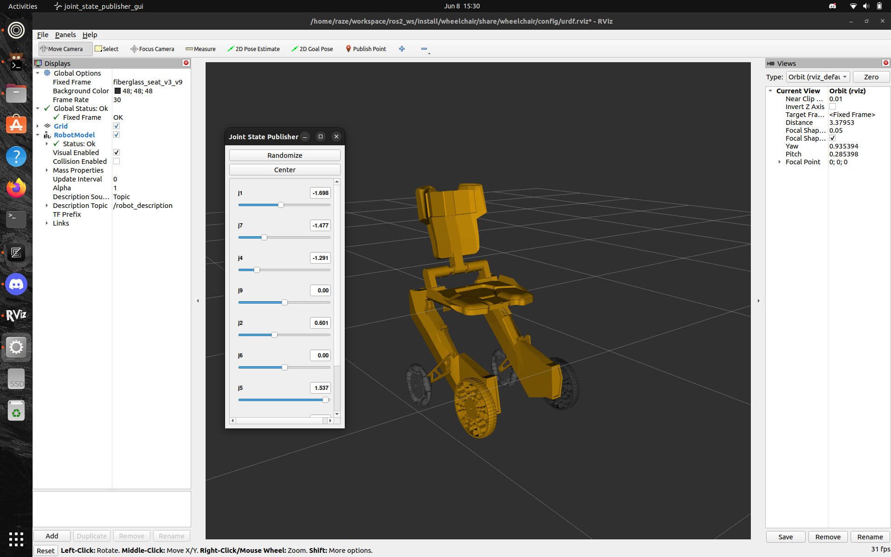

# NishCorp-Tech Wheelchair ROS 2 Package

A ROS 2 package for robotic wheelchair control and visualization, developed by NishCorp-Tech. This package provides nodes and launch files for controlling, monitoring, and visualizing a robotic wheelchair platform.

---

## Features

- ROS 2 nodes for wheelchair control and monitoring
- Visualization via RViz or similar tools
- Example launch files for quick startup
- Modular and extensible design

---

## Requirements

- ROS 2 Humble Hawksbill (or later)
- Python 3.8+ (if using Python nodes)
- Colcon build system
- RViz (for visualization)

---

## Installation

1. **Clone the repository into your ROS 2 workspace:**

    ```bash
    cd ~/ros2_ws/src
    git clone https://github.com/Siddhant-nishcorptech/NishCorp-Tech.git
    ```

2. **Install dependencies:**

    If your package has dependencies listed in `package.xml`, install them with:

    ```bash
    cd ~/ros2_ws
    rosdep install --from-paths src --ignore-src -r -y
    ```

3. **Build the package:**

    ```bash
    cd ~/ros2_ws
    colcon build --packages-select wheelchair
    ```

4. **Source your workspace:**

    ```bash
    source install/setup.bash
    ```

---

## Usage

### Running the Visualization

To launch the display (visualization) for the wheelchair, use the provided `display.launch.py` file:

```bash
ros2 launch wheelchair display.launch.py
```

This will start the visualization node(s), typically opening RViz with a pre-configured display for the wheelchair.

---

## Example Output

Below is an example screenshot of the expected output when running `display.launch.py`:



---

## Nodes

- **wheelchair_controller**: Main node for controlling the wheelchair (details in source)
- **wheelchair_monitor**: Node for monitoring wheelchair status (details in source)

---

## Launch Files

- **display.launch.py**: Launches visualization (RViz) for the wheelchair
- **working on gazebo launch**
